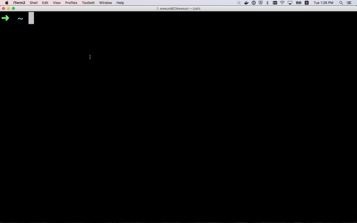

# json-editor-online-command-line-tool
JSON editor online command line tool for you to edit you local json file online



### JSON editor online command line - free your hands

For super star JSON, all the IDE and online tools all supported well.

But for the lazy man like me, still too complex.

1. I need to open local json file, double click or right click.
2. After open it, I also need to copy it to clipboard.
3. When I get it in clipboard, then I need to open the web tool (only if i could remember the long bored address), and paste to it.

It's really complex, is there a way, that I can only use one command line to open my local json file on web service?

Of course, and here we are:
 
NPM package

```
$ npm install -g json-editor-online

$ json <filename.json>

```

Videos：

[Youtube](https://www.youtube.com/watch?v=QlXht9L9hEY) 

[Youku](http://v.youku.com/v_show/id_XMjk3MDc2MTcyOA==.html?spm=a2h3j.8428770.3416059.1)

Enjoy!

### JSON在线编缉器命令行工具-解放你的双手

对于JSON这种明星来说，哪哪儿都有对TA无微不至的关怀。各种IDE里已经成了标配、各种在线工具也是体贴入微，该有的功能都有了。

但对于我这种懒人来说，这还是不够简单，还是太麻烦：

1. 打开本地文件，我还得双击或者右击打开文件。
2. 打开了后还得拷贝
3. 拷贝好后还得打开网站（首先我得记得住），然后再粘贴到线上编缉器

整修流程还是太繁琐，有没有一种方法，或者一条命令，让我一下子把这些事全都帮我干了？

当然有，下面为大家推荐一个好用的命令行工具：

官方 NPM package

```
安装：npm install -g json-editor-online
使用：json <filename.json>
```

一条命令，解决所有烦恼。不谢！

相关操作视频：

[Youtube](https://www.youtube.com/watch?v=QlXht9L9hEY) 

[Youku](http://v.youku.com/v_show/id_XMjk3MDc2MTcyOA==.html?spm=a2h3j.8428770.3416059.1)


